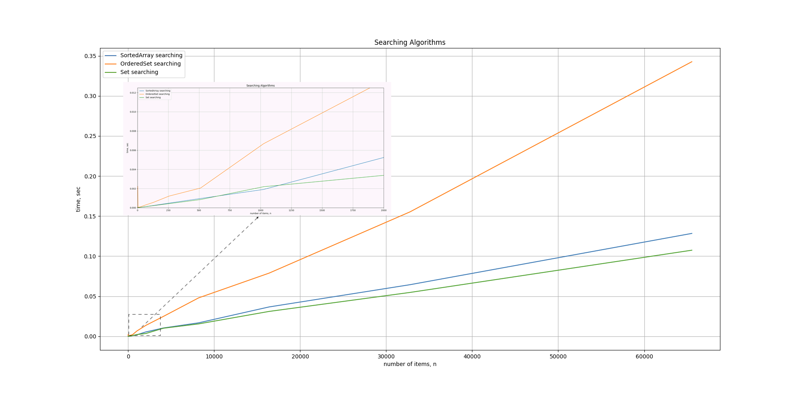

# Algorithms

### Description

*Algorithms is a framework inlcuding all algorithms and data structures + some extensions for embedded Swift Collection (see. below) that commonly used for iOS/Mac/tvOS development.*. 

Besides that in scope of some algorithm investigation, performance tests have been measured (See. [Benchmarks](https://github.com/RoMaN16102012/Algorithms/tree/master#benchmarks)).

### Requirements (Programming language)

Swift 5.2 & Objective-C 2.0

### Algorithm List

- [x] [**Queue**](https://github.com/RoMaN16102012/Algorithms/blob/master/Algorithms/Source/Queue/Swift/Queue.swift) - [Queue](https://en.wikipedia.org/wiki/Queue_(abstract_data_type)) data structure.
- [x] [**Stack**](https://github.com/RoMaN16102012/Algorithms/tree/master/Algorithms/Source/Stack/Swift) - [Stack](https://en.wikipedia.org/wiki/Stack_(abstract_data_type)) data structure.
- [x] **Priority Queue** - framework contains Swift implemenation of [Priority Queue](https://github.com/RoMaN16102012/Algorithms/blob/master/Algorithms/Source/PriorityQueue/Swift/PriorityQueue.swift), based on own [Heap](https://github.com/raywenderlich/swift-algorithm-club/blob/master/Heap) implementation, and wrapper around Apple's [CFBinaryHeap](https://developer.apple.com/documentation/corefoundation/cfbinaryheap) and it has been adjusted to Swift API.
- [x] **Ordered Set** - framework contains own implementation of [Ordered Array](https://github.com/RoMaN16102012/Algorithms/blob/master/Algorithms/Source/SortedArray/Swift/OrderedArray.swift), and [Ordered Set](https://github.com/RoMaN16102012/Algorithms/blob/master/Algorithms/Source/OderedSet/OrderedSet.swift) wrapper arround [NSMutableOrderdSet](https://developer.apple.com/documentation/foundation/nsmutableorderedset).
- [x] [**Segment Tree**](https://github.com/RoMaN16102012/Algorithms/blob/master/Algorithms/Source/SegmentTree/Swift/SegmentTree.swift) - implemenation of Segment Tree, based on own implementation of [Segment Tree](https://github.com/raywenderlich/swift-algorithm-club/tree/master/Segment%20Treet). Besides contains [*Segment Tree*] using [lazy propagation](https://github.com/raywenderlich/swift-algorithm-club/blob/master/Segment%20Tree/LazyPropagation/README.markdown) technic.
- [x] [**LinkedList**](https://github.com/RoMaN16102012/Algorithms/blob/master/Algorithms/Source/LinkedList/LinkedList.swift) - [Single Linked List](https://en.wikipedia.org/wiki/Linked_list) data structure, and optimizied [Single Linked List](https://github.com/RoMaN16102012/Algorithms/blob/master/Algorithms/Source/LinkedList/LinkedList%2BCOW.swift) with [Copy-On-Write](https://medium.com/@lucianoalmeida1/understanding-swift-copy-on-write-mechanisms-52ac31d68f2f) semantic.
- [x] [**Trie**](https://github.com/RoMaN16102012/Algorithms/blob/master/Algorithms/Source/Trie/Trie.swift) - Trie data structure, [also called digital tree or prefix tree](https://en.wikipedia.org/wiki/Trie#:~:text=In%20computer%20science%2C%20a%20trie,the%20keys%20are%20usually%20strings.)
- [x] [**A thread safe swift array.**](https://github.com/RoMaN16102012/Algorithms/blob/master/Algorithms/Source/SynchrinizedArray/SynchronizedArray.swift) - Thread safe Swift array.
- [x] [**Graph**](https://en.wikipedia.org/wiki/Graph_(abstract_data_type)) - implementaion of Graph data structure.
- [x] **Extensions**:
	-  Searching: [Binary search](https://en.wikipedia.org/wiki/Binary_search_algorithm), [Interpolation search](https://en.wikipedia.org/wiki/Interpolation_search), [Exponential search](https://en.wikipedia.org/wiki/Exponential_search) algorithms;
	- Max/min: extension of Swift Array to find [index of max/min](https://github.com/RoMaN16102012/Algorithms/blob/master/Algorithms/Source/Extensions/Array%2BArgMaxMin.swift) value in unsorted array; 
	- Max/min: high-performance extension for array of Double elements to find [index of max/min](https://github.com/RoMaN16102012/Algorithms/blob/master/Algorithms/Source/Extensions/Array%2BOptimizedArgMaxMin.swift) element, that based on Apple's [Accelerate](https://developer.apple.com/documentation/accelerate);
	- Sorting: implementation of sorting algorithms in Swift;
	- [Order statistics](https://github.com/RoMaN16102012/Algorithms/blob/master/Algorithms/Source/Extensions/Array%2BkStatistics.swift): extension to find K’th smallest/largest element in Unsorted Array;
- [x] **LRUCache** - Least recently used ([LRU](https://en.wikipedia.org/wiki/Cache_replacement_policies#Least_recently_used_(LRU))) cache implementation (inspired by [SwiftlyLRU](https://github.com/justinmfischer/SwiftlyLRU))
- [x] [**Bit Vector**](https://github.com/RoMaN16102012/Algorithms/blob/master/Algorithms/Source/BitVector/BitVector.swift) - implementation of bit array wrapped Apple's [CFMutableBitVector](https://developer.apple.com/documentation/corefoundation/cfmutablebitvector-rqf).
- [x] **Extra** - additional routines to deal with [COW](https://github.com/RoMaN16102012/Algorithms/blob/master/Algorithms/Source/Shared/COW.swift) (Copy-on-write) semantic.

### Benchmarks

#### Searching Collections

Figure below compares searching operation among [Ordered Array](https://github.com/RoMaN16102012/Algorithms/blob/master/Algorithms/Source/SortedArray/Swift/OrderedArray.swift), [Ordered Set](https://github.com/RoMaN16102012/Algorithms/blob/master/Algorithms/Source/OderedSet/OrderedSet.swift), and searching extension of Swift [Set](https://github.com/RoMaN16102012/Algorithms/blob/master/Algorithms/Source/Extensions/Set%2BSearching.swift).

*There are 2 remarkable aspects*: 
1) **Ordered Set** has the same asymptotic plot **Ordered Array** (but with different constant value {x3 more}). It means, [NSMutableOrderdSet](https://developer.apple.com/documentation/foundation/nsmutableorderedset) works as Sorted Array under the hood.
2) Searching [Set](https://github.com/RoMaN16102012/Algorithms/blob/master/Algorithms/Source/Extensions/Set%2BSearching.swift) extension behaves itself as **Ordered Array** does. 

#### Searching algorithms

| Count         | Binary Search | Interpolation Search  | Exponential Search |
| ------------- |:-------------:|:---------------------:|:------------------:|
| 10 000        |    2.9e-06    |      2.6e-06          |       4.7e-06      |
| 1 000 000     | 	 3.9e-06    |      3.0e-06 			|       4.8e-06      |
| 10 000 000    |    2.0e-05    |      1.9e-05 			|       8.1e-06     |

*Please notice: [**Interpolation Search**](https://en.wikipedia.org/wiki/Interpolation_search) shows the best time complexity (*O(log(log(n)))*) provided that the elements are uniformly distributed, otherwise it will show the worst time complexity (*O(n)*). So the measurement has been performed on uniformly distributed items.*
